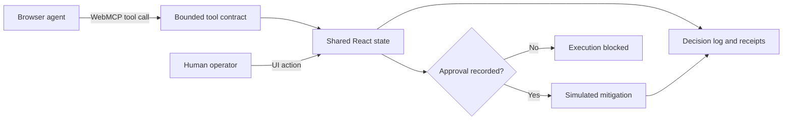

# Architecture

Runbook Relay is deliberately small: one deterministic state model powers the human interface, the browser-native WebMCP tools, and the labeled simulator.

## Runtime layers

The project keeps three concerns separate:

| Layer | Role | Runbook Relay status |
|---|---|---|
| Standard page API | Registers tools through `document.modelContext`; execution stays in the page and shares the visible session | Implemented |
| Compatibility runtime | Supplies the page API in a browser that does not provide it natively | Not bundled |
| Transport bridge | Carries discovery, calls, results, and lifecycle events between the page and an iframe, extension, or external MCP client | Not implemented or tested |

This separation follows the practical layering documented by [MCP-B](https://docs.mcp-b.ai/explanation/architecture/runtime-layering) without making MCP-B part of the production bundle. The native path remains the shortest proof: the browser discovers tools registered by the page, and the handlers execute against the same state a human sees.

A future compatibility evaluation may expose the same five contracts through an [MCP-B transport](https://docs.mcp-b.ai/explanation/architecture/transports-and-bridges) to Claude Desktop or Cursor. That would be independent cross-client evidence. It would not prove native WebMCP support in those clients and must not move execution or approval out of the page.

## Design decisions

- **One state model:** Human controls, native tool calls, and simulator calls use the same application state and audit surfaces.
- **Narrow tools:** Five operations separate reading, comparing, staging, executing, and resetting.
- **Fail-closed execution:** The execution tool cannot create approval. It checks approval recorded through the page.
- **Deterministic fixtures:** The incident, three mitigations, projected outcomes, and recovered telemetry are stable and resettable.
- **Visible evidence:** Tool receipts show caller, input, policy outcome, structured result, and timestamp.
- **Bounded agent surface:** A deterministic fixture budgets tool-definition size, structured-result size, and calls for the blocked-before-approval workflow.
- **No backend dependency:** The public demo changes no external system and uses no credentials.
- **Standards-first surface:** The application uses `document.modelContext` directly and removes registrations with an `AbortController`; no polyfill, hook, resource extension, or relay is required.

The [agent interface efficiency note](agent-efficiency.md) documents the structural measurement and its limits. It reports UTF-8 bytes so the regression gate remains provider-independent. A model evaluation must add actual token usage, latency, retries, and verified outcomes.

## Production boundary

This is a browser-side reference implementation, not a production operations console. A production design would move authorization and execution server-side, bind actions to scoped identities, persist tamper-evident audit records, enforce idempotency, and validate live infrastructure state immediately before execution.
