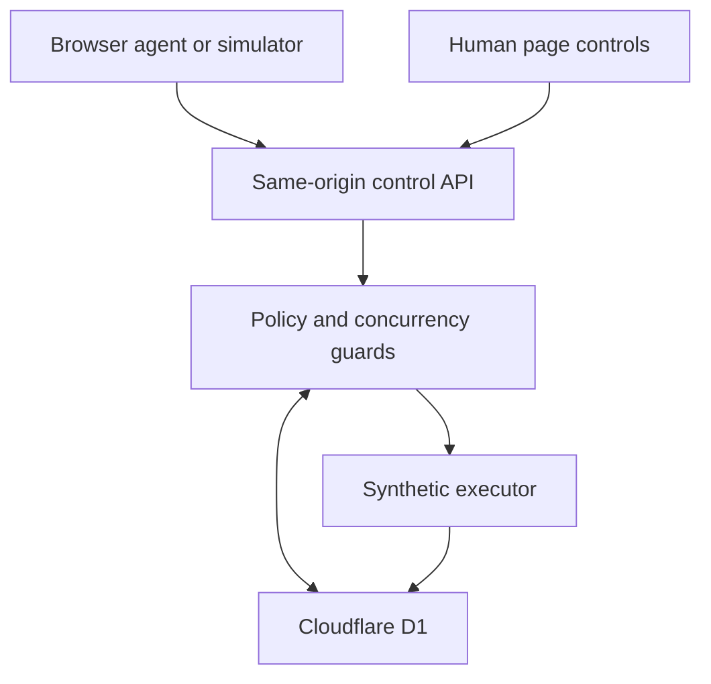
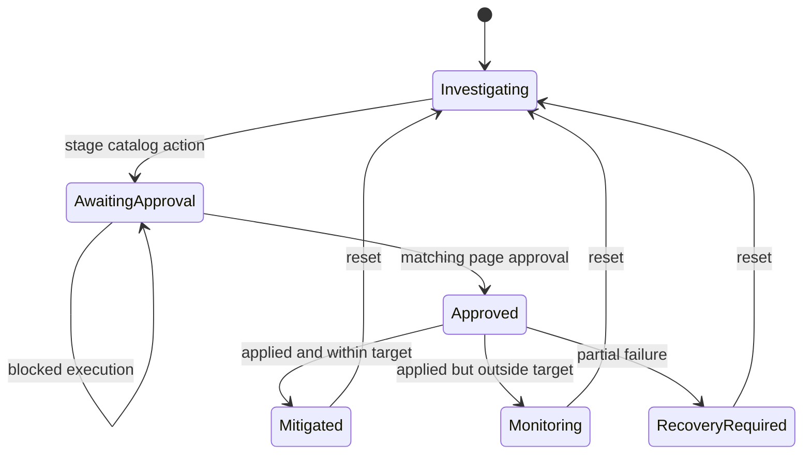

# Architecture

Runbook Relay keeps presentation and policy separate. Native WebMCP tools, the labeled simulator, and page controls all call one same-origin server API. Cloudflare D1, not React state, owns the durable incident, approval, execution, and receipt records.

## Components

| Component | Responsibility | Trust level |
|---|---|---|
| React page | Render shared state, register WebMCP tools, collect a page approval click | Untrusted client |
| WebMCP handlers | Translate five bounded tool contracts into API operations | Untrusted caller input |
| `/api/control-plane` | Validate origin, media type, schema, session, and operation | Server boundary |
| Control-plane service | Calculate digests and keys; enforce approval, replay, and state guards | Policy authority |
| Cloudflare D1 | Persist sessions, approvals, executions, and receipts | Durable system of record |
| Synthetic executor | Return deterministic success or partial-failure fixture output | Demo-only external boundary |

## Durable model

Four D1 tables make the control flow inspectable:

| Table | Key records |
|---|---|
| `control_sessions` | Session identity label, incident state, resource version, staged action, action digest, idempotency key, receipt head |
| `approvals` | Action digest, version, approver session identity, approval and expiry times, consumption time |
| `executions` | Unique action and idempotency bindings, outcome, stored result, timestamp |
| `receipts` | Actor channel and identity, tool/event, inputs, result, outcome, version, previous hash, content hash |

The migration is generated from [db/schema.ts](../db/schema.ts) and committed under [drizzle](../drizzle/). Sites packages that directory with the build; the owned Cloudflare workflow applies migrations before deployment.

## State transition

Approval is a record attached to the current state rather than a free-standing Boolean. Staging increments `resource_version`, calculates a SHA-256 action digest over incident ID, mitigation ID, and version, and derives a session-specific idempotency key. Approval must match that exact digest and version, expires after five minutes, and is consumed by execution.

Successful action application and service recovery are separate outcomes. The deterministic executor enters `mitigated` only when the observed latency, error rate, and saturation are all within the displayed targets. An applied action that misses a target enters `monitoring`; a partial application enters `recovery-required`.

## Concurrency and replay

Every mutation uses a compare-and-swap condition over the current version and receipt-chain head. The receipt insert is additionally guarded by the new session head, so a request that loses the state race cannot append an orphan receipt. Approval insertion is guarded by the state transition that recorded its receipt.

Execution uses a unique `(session_key, idempotency_key)` constraint and a unique `(session_key, action_digest)` constraint. Its insert succeeds only while:

- staged digest, version, and idempotency key match;
- approval belongs to the same session identity;
- approval is unused and unexpired; and
- the receipt head has not changed.

The exact replay returns the stored execution result. Reusing a key for a different action is blocked. This prevents duplicate synthetic effects while keeping retries safe.

## Receipt chain

Each receipt hash covers canonical JSON containing its session, event, caller channel and identity, outcome, input, result, detail, action digest, resource version, previous hash, and timestamp. The snapshot API reads session state, its matching approval, executions, receipts, and receipt count in one transactional D1 batch. It returns the latest 100 receipts plus one anchor in insertion order when needed, recomputes content hashes, and verifies every link in that returned segment; total count, truncation, and head are reported separately.

This detects modification inside the verified segment. It does not provide a signature, trusted timestamp, or external transparency anchor.

## Session boundary

The server issues a random 256-bit cookie with `HttpOnly`, `SameSite=Strict`, a 24-hour lifetime, and `Secure` on HTTPS. Only a SHA-256-derived session key and short public label are stored. State-changing requests must have an exact same-origin `Origin` header and `application/json` content type. Worker responses deny framing and set conservative content, referrer, and device-permission headers.

This is a scoped anonymous browser session, not authenticated workforce identity. It isolates demo users and binds their approval state; it does not establish employee role, authorization, or independent proof of human presence.

## WebMCP and compatibility layers

| Layer | Runbook Relay status |
|---|---|
| Standard page API | Five tools registered through `document.modelContext`; implemented |
| Compatibility runtime | Not bundled |
| Transport bridge | Not implemented or tested |

The standard page API is only the discovery and invocation surface. It does not become the policy authority. A future MCP-B or external client bridge would add origin, sender identity, relay exposure, and per-connection isolation requirements described in the [threat model](threat-model.md).

## Evaluation architecture

The [50-task harness](../evals/live-tool-use/README.md) uses the same five bounded tool definitions with a deterministic in-process fixture. The runner calls the OpenAI Responses API with `store: false`, carries output and encrypted reasoning items between turns, disables parallel tool calls, records request IDs, and calculates latency, token, and cost totals. It requires a pinned model and explicit pricing inputs.

Automatic trace grades are a first pass. A complete evidence package also requires human labels for task success, policy safety, response quality, and failure taxonomy.

## Production boundary

The project demonstrates a production-style control pattern over a synthetic action. A real incident system would additionally need authenticated workforce identity and roles, phishing-resistant human authorization, scoped infrastructure credentials, secrets management, independently anchored audit records, redaction and retention controls, live precondition checks, recovery orchestration, and multi-region resilience.
