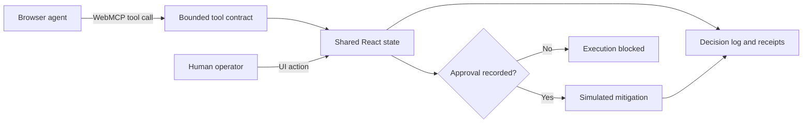

# Architecture

Runbook Relay is deliberately small: one deterministic state model powers the human interface, the browser-native WebMCP tools, and the labeled simulator.

## Design decisions

- **One state model:** Human controls, native tool calls, and simulator calls use the same application state and audit surfaces.
- **Narrow tools:** Five operations separate reading, comparing, staging, executing, and resetting.
- **Fail-closed execution:** The execution tool cannot create approval. It checks approval recorded through the page.
- **Deterministic fixtures:** The incident, three mitigations, projected outcomes, and recovered telemetry are stable and resettable.
- **Visible evidence:** Tool receipts show caller, input, policy outcome, structured result, and timestamp.
- **No backend dependency:** The public demo changes no external system and uses no credentials.

## Production boundary

This is a browser-side reference implementation, not a production operations console. A production design would move authorization and execution server-side, bind actions to scoped identities, persist tamper-evident audit records, enforce idempotency, and validate live infrastructure state immediately before execution.
